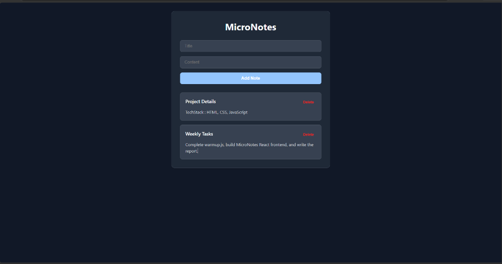

# MicroNotes

A small full-stack notes application built using a React frontend (Vite) and a Node/Express backend. Notes are stored in an in-memory array on the server (which resets upon restarting the server).

## Features
- **Create**: Add a note with a title and content.
- **Read**: View a list of all saved notes automatically on page load.
- **Delete (Bonus)**: Remove individual notes from the server via a "Delete" button.
- **Form Validation (Bonus)**: The "Add Note" button is disabled unless a title is typed.
- **Loading Indicator (Bonus)**: Displays "Loading notes..." while fetching data from the server.
- **Dark Mode Support**: UI automatically adapts to your system's light/dark mode preference.

## Project Structure
```text
micronotes/
├── client/                 # React app (Vite)
│   └── src/
│       ├── App.jsx         # Core React layout & logic
│       └── index.css       # Custom minimalist styling
├── server/                 # Express backend
│   ├── server.js           # REST API endpoints & in-memory notes store
│   └── package.json
├── warmup.js               # JavaScript basics practice warm-up
├── README.md               # Getting started instructions
└── .gitignore
```

## How to Run locally

### 1. Start the Backend Server
1. Navigate to the `server` directory:
   ```bash
   cd server
   ```
2. Install dependencies:
   ```bash
   npm install
   ```
3. Start the server:
   ```bash
   node server.js
   ```
   The backend will run on [http://localhost:5000](http://localhost:5000).

### 2. Start the Frontend client
1. Open a new terminal window and navigate to the `client` directory:
   ```bash
   cd client
   ```
2. Install dependencies:
   ```bash
   npm install
   ```
3. Start the Vite development server:
   ```bash
   npm run dev
   ```
   The frontend will run on [http://localhost:5173](http://localhost:5173).

## Screenshot


